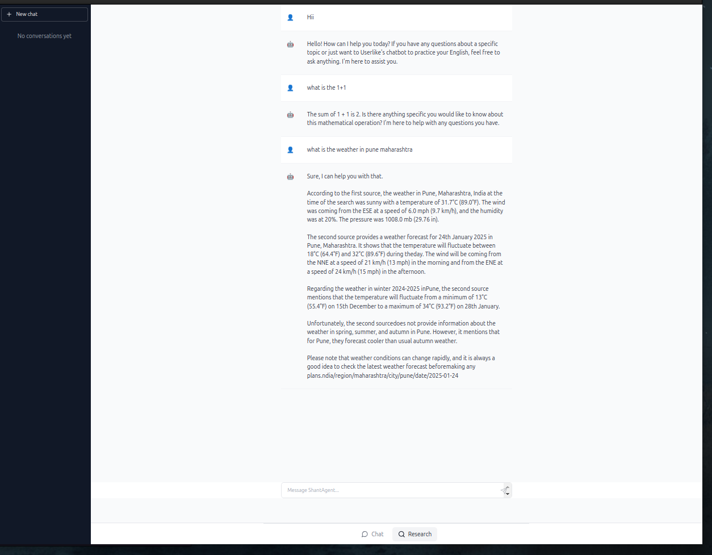
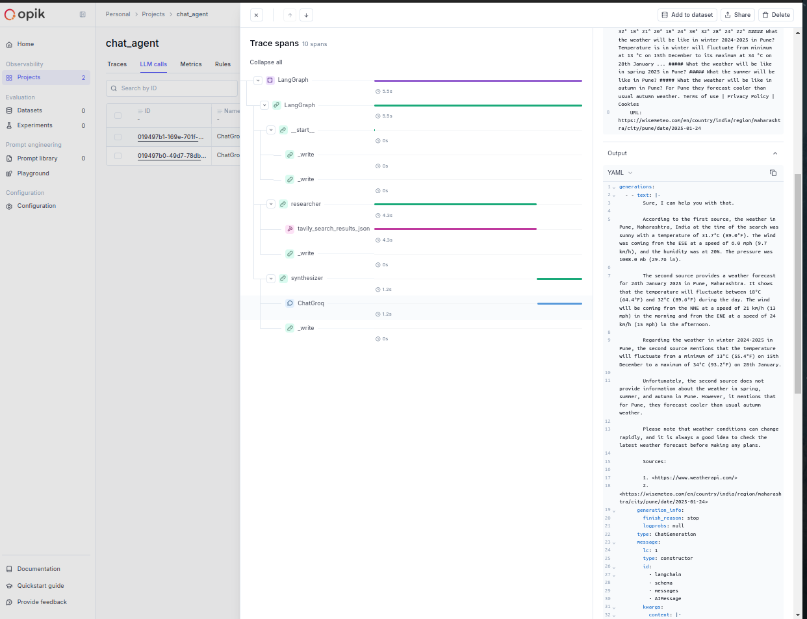

# ShantAgent UI


Modern React-based user interface for ShantAgent, designed to work with the [ShantAgent Backend](https://github.com/SuyodhanJ6/shantagent).

## 💫 UI Preview



The ShantAgent interface provides a modern, intuitive chat experience with features like:
- Multi-modal conversations
- Real-time streaming
- Thread management
- Research mode with citations

## 📊 Monitoring Dashboard



The OpIk monitoring dashboard provides real-time insights into:
- System performance
- API response times
- Error rates
- Resource utilization
- User interactions

## ⚠️ Important: Backend Required

Before setting up the UI, clone the backend repository:

```bash
git clone https://github.com/SuyodhanJ6/shantagent.git
cd shantagent
```

Visit the [ShantAgent Backend Repository](https://github.com/SuyodhanJ6/shantagent) for complete backend setup instructions.

## 🚀 UI Setup

### Prerequisites

- Node.js (v18 or higher)
- npm or yarn
- Backend server running at http://localhost:8000

### Installation Steps

1. **Clone UI Repository**
   ```bash
   git clone https://github.com/SuyodhanJ6/shantaAgent-UI.git
   cd shantaagent-ui
   ```

2. **Install Dependencies**
   ```bash
   npm install
   # or
   yarn install
   ```

3. **Configure UI Environment**
   ```bash
   # Copy environment template
   cp .env.example .env
   ```

   Update `.env` with backend URL:
   ```env
   VITE_API_URL=http://localhost:8000/v1
   VITE_AUTH_TOKEN=your_auth_token_here  # If required by your backend
   ```

4. **Start Development Server**
   ```bash
   npm run dev
   # or
   yarn dev
   ```

5. **Verify Setup**
   - Open browser to `http://localhost:5173`
   - Ensure connection to backend by sending a test message
   - Check OpIk dashboard at `/monitoring` for system metrics

## 📱 UI Features

- **Chat Interface**
  - Multi-modal conversation support
  - Real-time message streaming
  - Thread management
  - Research mode with citations

- **User Experience**
  - Responsive design
  - Dark mode support
  - Loading states & animations
  - Error handling

- **Monitoring**
  - Real-time performance metrics
  - System health monitoring
  - Error tracking
  - Resource utilization graphs

## 💻 Available Scripts

- `npm run dev` - Start development server
- `npm run build` - Build for production
- `npm run preview` - Preview production build

## 🛠 Tech Stack

- React 18
- Vite
- Tailwind CSS
- Lucide React Icons
- OpenTelemetry/OpIk

## 📝 License

This project is licensed under the MIT License - see the [LICENSE](LICENSE) file for details.

## 🔗 Related

- [ShantAgent Backend](https://github.com/SuyodhanJ6/shantagent) - FastAPI & LangChain backend